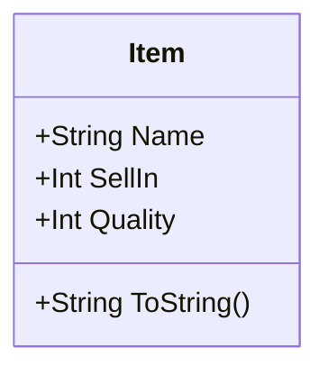
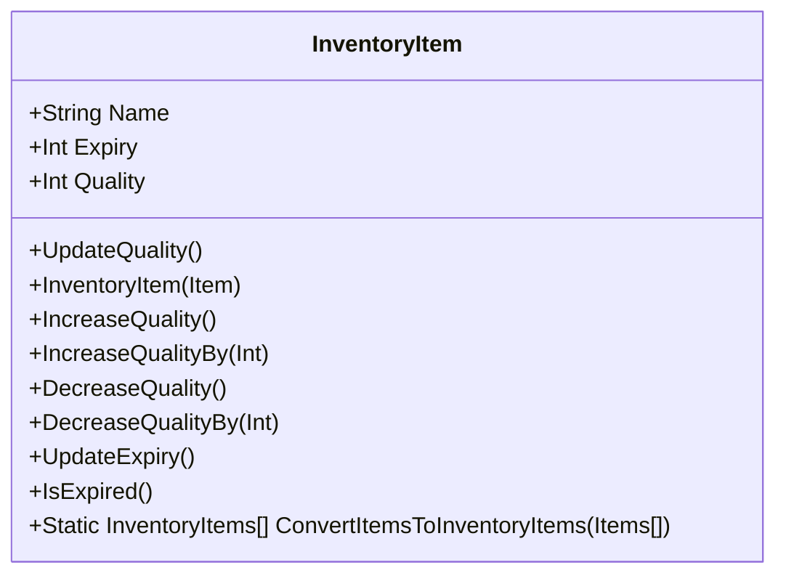
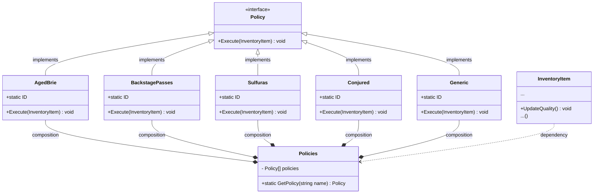

# Assumptions

* `Item` is a service contract, a data model that is used to integrate with Goblin's system.
* We must not modify the `Item` calss, othrewise it can break the integration

# Design

The `Item` is treated as data model that is used as service contract for integration purpose. 
Hence, we have developed `InventoryItem`, an appropriate concept in the context of GildedRose.
`InventoryItem` is a domain entity that has its own operation, it is composed on top of Item.

This has helped to simplify GildedRose down to two simplified operations named based on GildedRose 
business terminologies. The `UpdateQuality()` method in it iterates over the `InventoryItems` list
and calls `UpdateQuality()` on each item.

As `InventoryItem` is composed on top of `Item` class, so it has its own operation that perform operations
on `Item`'s properties such as `SellIn` and `Quality`. We have introduced the term `Expiry` to keep it 
in line with day to day business terminology. When `UpdateQuality()` is called on an inventory item, 
it gets the applicable policy for it, and applies it on inventory item by calling `Policy`'s 
`execute()` method.

We have introduced the `Policies` module, it is to make the policies extendable, so that we can
keep up with the growth of the business. The term policies/policy is used to keep aligned with 
business terminologies. These requirements are technically quality policies in the context of 
GildedRose business.

The design of `Policies` and its integration with `InventoryItem` is inspired by `Strategy` and `State` 
design patterns. It's not typical `Strategy` or `State` pattern.

The key here is the `Policy` interface, that is implemented by each concrete `Policy` such as `AgedBrie`.
Then these concrete policies are configured in `Policies.GetPolicy()`. 
This way `InventoryItem.UpdateQuality()` doesn't need to know the concrete policies. 
All it needs is to ask the `GetPolicy(string name)` to figure out the policy to be executed.

This design has benefits over typical inheritence based polymorphism because it's based on the 
concpept of composition. We can compose new policies by leveraging existing ones. In addition, 
a policy can be used for multiple item categories in `Policies` configuration. Also, it is 
possible to add new interfaces as need arises, and multiple interaces can be implemented. While
inheritence in C# is single inheritence.

The design is flexible enough that it can be changed and refactored easily if there is need to 
abandon this one and go for a new structure.

The `PolicyNames` in constants are added to avoid potential bugs caused by magic strings.

The tests are moved to `Tests` folder so that they have their own home for better organization.

# How to run this solution?

1. Clone the repository
2. Run `git switch feature/conjured-quality-update`
3. Open `csharp/csharp.sln` in Visual Studio
4. Run all tests by pressing `Ctrl+R A`